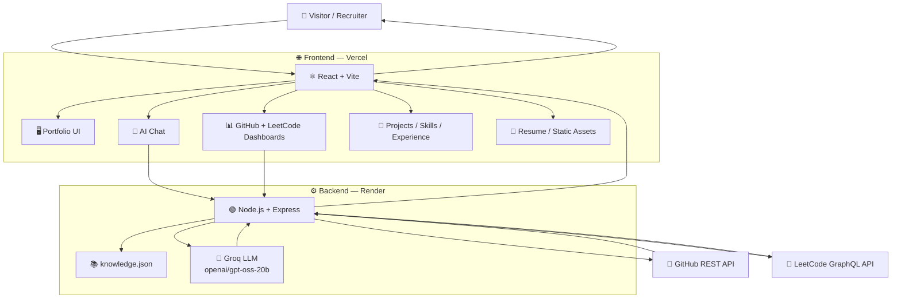
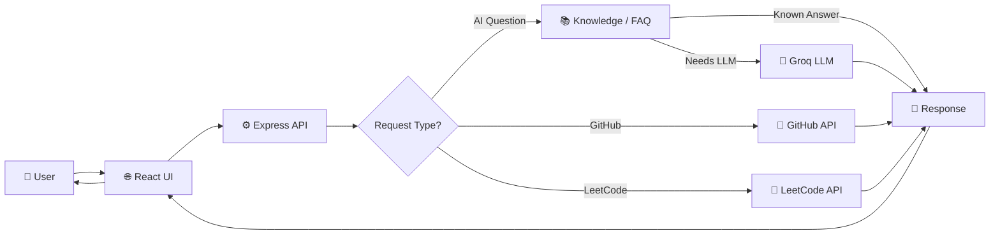
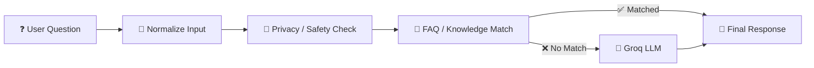
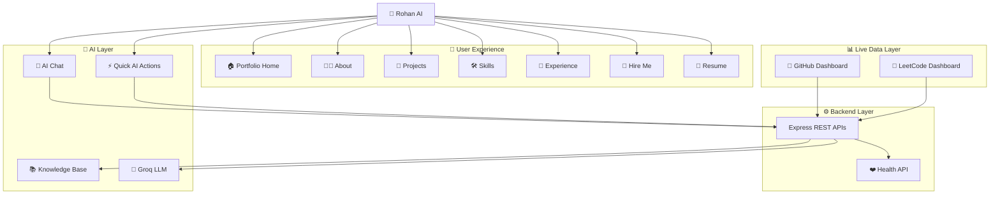
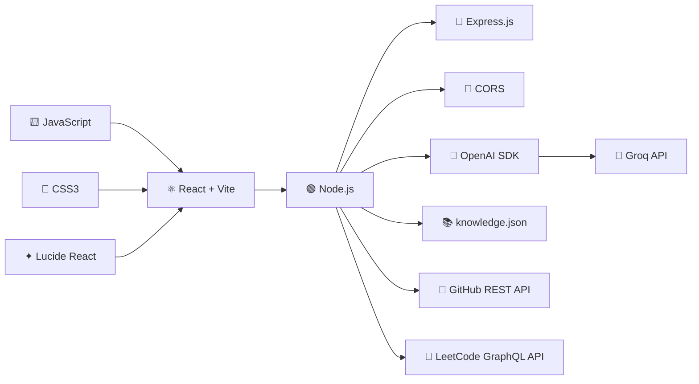
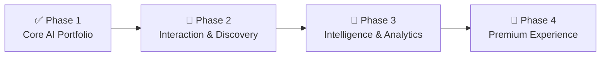

# 🤖 Rohan AI — Personal AI Portfolio Agent

<div align="center">

### Turning a Traditional Portfolio into an Interactive AI Experience

[](https://rohan-personal-ai-agent.vercel.app/)
[](https://react.dev/)
[](https://nodejs.org/)
[](https://groq.com/)
[](https://www.mongodb.com/mern-stack)

[🌐 Live Portfolio](https://rohan-personal-ai-agent.vercel.app/) •
[💻 GitHub Repository](https://github.com/karakRohan/Rohan_personal_AI_Agent) •
[🧩 LeetCode](https://leetcode.com/u/Code_Rider42/)

</div>

---

## ✨ Overview

**Rohan AI** is a full-stack AI portfolio agent designed to make a developer portfolio more **interactive, informative, and recruiter-friendly**.

Instead of depending only on static pages, visitors can ask natural-language questions and explore Rohan's professional profile through an AI interface.

The application combines:

- ⚛️ React + Vite frontend
- ⚙️ Node.js + Express backend
- 🤖 Groq-powered LLM
- 📚 Structured `knowledge.json` portfolio knowledge base
- 🐙 GitHub REST API integration
- 🧩 LeetCode GraphQL API integration
- 📄 Resume and static portfolio assets

### 🎯 Core Idea

```text
Traditional Portfolio
        │
        ▼
  Static Information
        │
        ▼
 ┌─────────────────┐
 │    Rohan AI     │
 │                 │
 │ Ask → Explore   │
 │ Learn → Hire    │
 └─────────────────┘
        │
        ▼
Interactive AI-Powered
Digital Representative
```

---

# 🏗️ System Architecture

The application follows a simple full-stack architecture where the frontend communicates with a central Express backend. The backend combines structured portfolio knowledge, AI generation, and live developer-data APIs.



---

# 🔄 Request & Response Flow



---

# 🧠 AI Response Architecture

The backend first normalizes and checks incoming questions, then attempts to answer from known portfolio information before falling back to the Groq LLM.



### Why this architecture?

```text
User Question
     │
     ▼
Normalize
     │
     ▼
Privacy / Safety
     │
     ▼
Known Knowledge?
   /       \
 Yes        No
 │           │
 ▼           ▼
Direct     Groq LLM
Answer       │
   \         /
    \       /
     ▼     ▼
   Final Response
```

This keeps common portfolio answers grounded in the application's known data while preserving a conversational AI experience.

---

# 🧩 Core Project Modules



---

# ⚡ Key Features

## 🤖 AI Portfolio Chat

Visitors can ask natural-language questions about:

- 💻 Technical skills
- 🚀 Projects
- 🤖 AI / LLM interests
- 🧠 Coding journey
- 🎓 Education
- 💼 Career goals
- 🤝 Hiring information

## ⚡ Quick AI Actions

One-click prompts for important portfolio questions:

```text
┌──────────────────────┐
│ Ask About Skills     │
└──────────────────────┘

┌──────────────────────┐
│ Show My Projects     │
└──────────────────────┘

┌──────────────────────┐
│ Why Hire Rohan?      │
└──────────────────────┘

┌──────────────────────┐
│ Coding Journey       │
└──────────────────────┘
```

## 🐙 Live GitHub Dashboard

The backend connects to GitHub to retrieve profile and repository information, allowing the portfolio to present developer activity rather than only manually written static content.

## 🧩 Live LeetCode Dashboard

The application integrates with LeetCode data to display coding progress and problem-solving activity.

## 🚀 Projects Showcase

| Project | Stack | Focus |
|---|---|---|
| **Doctor Appointment Web** | MERN | Healthcare & appointment management |
| **Text To Image Generator** | MERN | AI-powered image generation |
| **Video Calling Chat App** | MERN + WebRTC | Real-time communication |

## 📄 Interactive Resume

The portfolio provides resume access with a preview experience so recruiters can quickly review the profile.

## 💼 Hire Me Section

A dedicated hiring section provides professional contact options for recruiters, companies, and collaboration opportunities.

## 📱 Responsive UI

Designed for:

```text
Desktop ──────── Laptop
     │             │
     └──────┬──────┘
            │
         Tablet
            │
         Mobile
```

## 🔐 Privacy-Aware Design

The AI experience is structured to avoid exposing private personal information and to focus on relevant professional/public profile details.

---

# 🛠️ Technology Stack



### Frontend

| Technology | Purpose |
|---|---|
| React.js | Component-based UI |
| Vite | Frontend development and build tooling |
| JavaScript | Application logic |
| HTML5 | Page structure |
| CSS3 | Responsive styling and animations |
| Lucide React | Interface icons |

### Backend

| Technology | Purpose |
|---|---|
| Node.js | Server runtime |
| Express.js | REST API server |
| CORS | Cross-origin communication |
| OpenAI SDK | LLM client interface |
| Groq API | LLM inference |
| `knowledge.json` | Structured portfolio knowledge |

### External Integrations

- 🐙 GitHub REST API
- 🧩 LeetCode GraphQL API
- 🤖 Groq OpenAI-compatible API

### Deployment

```text
⚛️ Frontend
      │
      ▼
   Vercel
      │
      │ API Requests
      ▼
🟢 Backend
      │
      ▼
   Render
```

---

# 📂 Project Structure

```text
Rohan_personal_AI_Agent/
│
├── backend/
│   ├── .env
│   ├── .env.example
│   ├── knowledge.json
│   ├── package.json
│   ├── package-lock.json
│   └── server.js
│
├── frontend/
│   ├── public/
│   │   ├── profile.jpg
│   │   ├── resume.pdf
│   │   └── resume-preview.png
│   │
│   ├── src/
│   │   ├── main.jsx
│   │   └── styles.css
│   │
│   ├── index.html
│   ├── package.json
│   └── package-lock.json
│
└── README.md
```

---

# ⚙️ Local Development

## 1. Clone the repository

```bash
git clone https://github.com/karakRohan/Rohan_personal_AI_Agent.git
```

## 2. Enter the project

```bash
cd Rohan_personal_AI_Agent
```

## 3. Install frontend dependencies

```bash
cd frontend
npm install
```

## 4. Install backend dependencies

Open another terminal:

```bash
cd backend
npm install
```

## 5. Configure environment variables

Create:

```text
backend/.env
```

Add:

```env
PORT=5000
GROQ_API_KEY=YOUR_GROQ_API_KEY
GROQ_MODEL=openai/gpt-oss-20b
```

> ⚠️ Never commit your real API key to GitHub.

## 6. Start the backend

```bash
cd backend
npm start
```

Backend:

```text
http://localhost:5000
```

## 7. Start the frontend

Open a second terminal:

```bash
cd frontend
npm run dev
```

Frontend:

```text
http://localhost:5173
```

---

# 🌐 Production Deployment

## Frontend — Vercel

Deploy the `frontend` directory to Vercel.

## Backend — Render

Deploy the `backend` directory as a Node.js Web Service on Render.

After deployment, update the API base URL inside:

```text
frontend/src/main.jsx
```

Example:

```js
const API = "https://your-backend-url.onrender.com";
```

> The production frontend should point to the deployed backend URL, not `http://localhost:5000`.

---

# 🔑 Environment Variables

The backend uses:

```env
GROQ_API_KEY=your_api_key
GROQ_MODEL=openai/gpt-oss-20b
PORT=5000
```

### Recommended `.gitignore`

```gitignore
node_modules/
.env
.env.local
.env.*.local
npm-debug.log*
```

### 🔒 Security Rule

Never expose:

```text
API Keys
Access Tokens
Secrets
Private Credentials
```

in source code, screenshots, commits, or README files.

---

# 🔌 Backend API Overview

| Method | Endpoint | Purpose |
|---|---|---|
| `GET` | `/api/health` | Backend health and configuration status |
| `GET` | `/api/profile` | Portfolio profile data |
| `GET` | `/api/github` | GitHub profile and repository data |
| `GET` | `/api/leetcode` | LeetCode statistics/data |
| `POST` | `/api/chat` | AI portfolio conversation |

### Health Check

```text
GET /api/health
```

Use this endpoint after deployment to verify that the backend is reachable.

---

# 🎯 Project Goals

This project explores the practical combination of:

```text
Full Stack Web Development
            +
Artificial Intelligence
            +
Large Language Models
            +
API Integration
            +
Real-Time Developer Data
            +
Conversational Interfaces
            +
Interactive UI/UX
            +
Portfolio Engineering
```

### Main Objective

> Build a portfolio that does more than display information — it should help communicate the developer behind it.

---

# 📈 Future Roadmap



### Phase 1 — Core AI Portfolio ✅

- AI portfolio chat
- Portfolio knowledge base
- GitHub integration
- LeetCode integration
- Resume access
- Recruiter-focused sections

### Phase 2 — Interaction & Discovery 🚧

- Smarter follow-up questions
- Deeper project exploration
- Improved recruiter workflows
- Better conversational navigation

### Phase 3 — Intelligence & Analytics 🔮

- Recruiter Mode
- Advanced developer analytics
- Interactive technology explorer
- AI-powered project recommendations

### Phase 4 — Premium Experience 🔮

- 🎙️ Voice interaction
- 🌐 Multilingual AI — English, বাংলা, हिन्दी
- ✨ Premium animations and transitions

---

# 👨‍💻 About Rohan

**Rohan Karak** is a Full Stack Developer and AI/ML enthusiast focused on building intelligent, scalable, and user-focused applications.

### Technical Interests

```text
MERN Stack
Python
AI / ML
LLMs
Generative AI
REST APIs
Data Structures & Algorithms
```

He is currently pursuing a **B.Tech in Computer Science and Engineering** and continuously works on software projects, problem-solving, and AI-powered applications.

---

# 🏆 Coding & Achievements

- 🔥 LeetCode 50 Days, 100 Days, 200 Days and 365 Days Coding Streak Badges
- 💻 430+ LeetCode Problems Solved
- 🧩 450+ GeeksforGeeks Problems Solved
- 🎯 GeeksforGeeks 100 Days Coding Challenge
- 🚀 Participated in College Hackathons at IEM Kolkata and NIT Rourkela
- 📜 Open Source GitHub Certificate — GDSC

---

# 📊 Developer Profile

```text
┌──────────────────────────────────────────┐
│              ROHAN KARAK                 │
├──────────────────────────────────────────┤
│ Role        : Full Stack Developer       │
│ Focus       : AI / LLM / GenAI           │
│ Education   : B.Tech CSE                 │
│ GitHub      : karakRohan                 │
│ LeetCode    : Code_Rider42               │
│ Projects    : MERN + AI + WebRTC         │
└──────────────────────────────────────────┘
```

---

# 🌐 Connect With Rohan

| Platform | Link |
|---|---|
| 🐙 GitHub | [karakRohan](https://github.com/karakRohan) |
| 💼 LinkedIn | [Rohan Karak](https://www.linkedin.com/in/rohan-karak-9a0b78288/) |
| 🌐 Portfolio | [Rohan Portfolio](https://rohanportfolio-eight.vercel.app/) |
| 🧩 LeetCode | [Code_Rider42](https://leetcode.com/u/Code_Rider42/) |
| 📚 GeeksforGeeks | [rohankarak](https://www.geeksforgeeks.org/profile/rohankarak) |

---

# ⭐ Support

If you find this project interesting, consider giving the repository a ⭐ on GitHub.

Your support helps motivate continued learning, experimentation, and development.

---

## ✨ Developer Motto

### ✨ Eat(). Sleep(). Code(). Repeat(). ✨

### 🙏 Trusting God's plan — every step, every decision 🕉️

---

<div align="center">

**Built with ❤️ using React, Node.js, Groq, APIs, and a lot of curiosity.**

</div>
